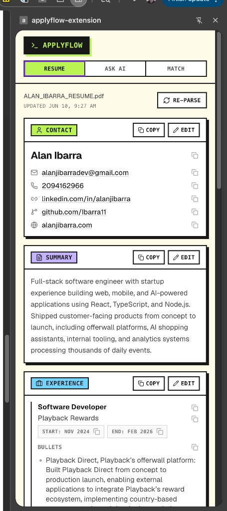
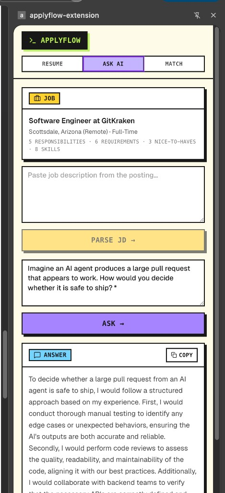
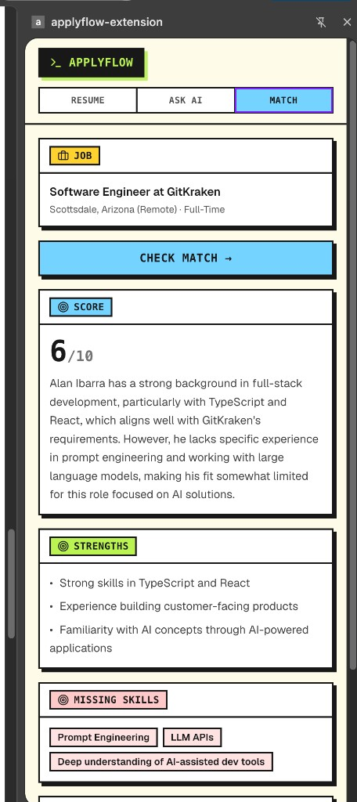

# ApplyFlow

ApplyFlow is a browser extension that helps you manage and speed up job applications. Upload your resume (PDF) once, and ApplyFlow keeps it handy in a persistent side panel while you browse job sites — parsing your resume, matching it against job postings, and answering application questions with AI.

## Screenshots

| Resume | Ask AI | Match |
| --- | --- | --- |
|  |  |  |

- **Resume** — parsed resume broken into editable, copyable sections (contact, summary, experience, …).
- **Ask AI** — paste a job description, parse it, and generate tailored answers to application questions.
- **Match** — score your resume against a posting, with strengths and missing skills.

## Status

Early development. The extension scaffolding, side panel, and UI foundation are in place. Resume parsing and the backend API are still being built out.

## Tech stack

| Area | Tech |
| --- | --- |
| Monorepo | pnpm workspaces |
| Extension | Manifest V3, React 19, TypeScript, Vite 8 |
| Extension tooling | [`@crxjs/vite-plugin`](https://crxjs.dev/vite-plugin) for MV3 builds + HMR |
| Styling | Tailwind CSS v4, shadcn/ui (Radix UI), Lucide icons |
| API | Node, Express 5, TypeScript (via `tsx`) |
| Shared | Zod schemas (shared validation between extension and API) |

## Repository layout

```
applyflow/
├── apps/
│   ├── extension/      # MV3 browser extension (React + Vite + CRXJS)
│   │   ├── src/
│   │   │   ├── components/ui/   # shadcn/ui components
│   │   │   ├── lib/             # utils (cn helper, etc.)
│   │   │   ├── App.tsx          # side panel UI (resume upload)
│   │   │   ├── main.tsx         # React entry, mounts into #root
│   │   │   ├── background.ts    # service worker (opens side panel on icon click)
│   │   │   └── index.css        # Tailwind + theme tokens
│   │   └── manifest.config.ts   # MV3 manifest (CRXJS)
│   └── api/            # Express API (resume parsing / backend — WIP)
└── packages/          # Shared code (Zod schemas)
```

## Getting started

### Prerequisites

- Node.js 20+
- pnpm

### Install

```bash
pnpm install
```

### Develop the extension

```bash
pnpm dev:extension
```

Then load it into a Chromium browser:

1. Open `chrome://extensions`.
2. Enable **Developer mode** (top-right).
3. Click **Load unpacked** and select `apps/extension/dist`.
4. Click the ApplyFlow toolbar icon to open the side panel.

> Note: changes to `manifest.config.ts` or `background.ts` require clicking the refresh icon on the extension card in `chrome://extensions`. UI changes hot-reload automatically.

### Develop the API

```bash
pnpm dev:api
```

### Run everything

```bash
pnpm dev
```

## Scripts

| Command | Description |
| --- | --- |
| `pnpm dev` | Run all workspaces in dev mode |
| `pnpm dev:extension` | Run the extension dev server (CRXJS) |
| `pnpm dev:api` | Run the API dev server |
| `pnpm --filter applyflow-extension build` | Production build of the extension |

## Browser support

The side panel API requires Chrome 114+ (or Chromium-based browsers like Edge, Brave, Arc). Firefox and Safari are not currently supported.
